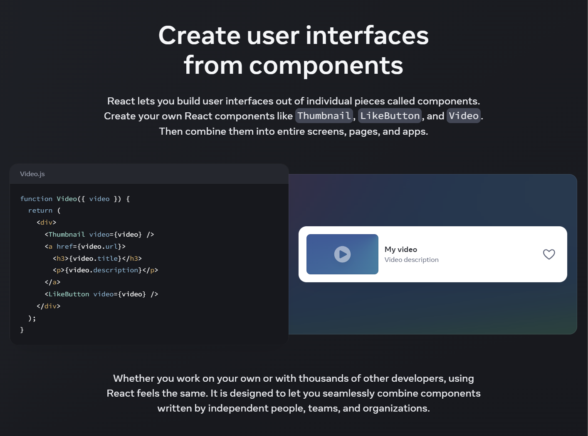
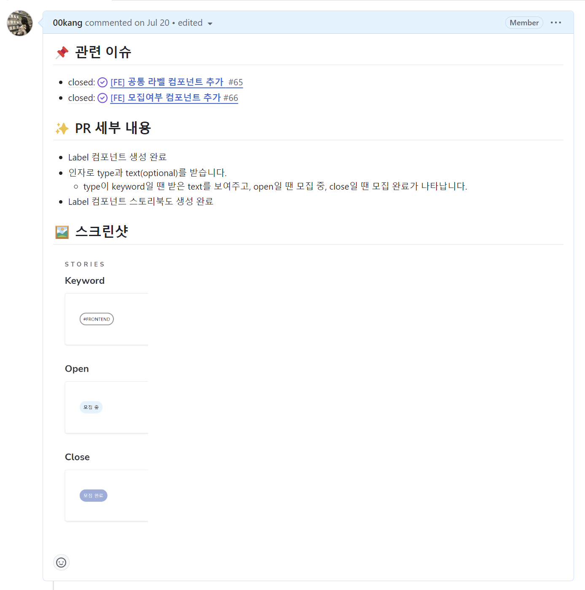

# React 공통 컴포넌트: 주니어 개발자를 위한 실용적 접근

<br/>

## 0. 목차

1. 개요
2. 공통 컴포넌트의 이해
3. 공통 컴포넌트 분리 기준
4. 재사용성과 유지보수성을 높이는 설계 원칙
5. 미래 요구사항에 대응하는 확장성 있는 설계
6. CoReA 프로젝트 사례 연구: Label 컴포넌트
7. 효과적인 문서화와 팀 공유 방법
8. 결론
9. 참고 자료

<br/>
<br/>

## 1. 개요

### 문서 주제

그동안 미션과 프로젝트를 진행하면서 다음과 같은 고민에 직면했습니다:

1. 어떤 기준으로 컴포넌트를 공통으로 분리해야 할까?
2. 어떻게 하면 재사용성이 높고 유지보수가 쉬운 컴포넌트를 만들 수 있을까?
3. 미래의 요구사항 변화에 유연하게 대응할 수 있는 컴포넌트를 어떻게 설계할 수 있을까?
4. 추상화된 공통 컴포넌트를 팀원들과 어떻게 효과적으로 공유하고 문서화할 수 있을까?

이 글에서는 이러한 고민들에 대한 해답을 찾아가는 과정과, 그 과정에서 얻은 인사이트를 공유하고자 합니다.

### 대상 독자

- 공통 컴포넌트 설계 및 분리에 고민 중인 주니어 프론트엔드 개발자
- UI/UX의 일관성과 개발 효율성 증대를 목표로 하는 개발자

### 문서 활용 계획

- 개인 기술 블로그 포스팅

<br/>
<br/>

## 1. 공통 컴포넌트의 이해

### 1-1. 공통 컴포넌트의 정의

React의 핵심 철학 중 하나는 컴포넌트 기반 개발이다. React 공식 문서에서는 "React lets you build user interfaces out of individual pieces called components."라고 설명한다. 이는 React가 컴포넌트라고 불리는 개별적인 조각들을 사용하여 사용자 인터페이스를 구축할 수 있게 해준다는 의미다.

여기서 '공통 컴포넌트'는 이러한 컴포넌트 중에서도 애플리케이션 전반에 걸쳐 재사용되는 UI 요소를 말한다. 버튼(Button), 입력 필드(Input), 모달 창(Modal) 등이 대표적인 예시다. 이들의 핵심 특징은 재사용성, 일관성, 그리고 추상화에 있다. 여러 페이지나 기능에서 반복적으로 사용되며, 일관된 디자인과 동작으로 사용자 경험을 향상시키고, 복잡한 로직이나 스타일을 캡슐화하여 사용을 간편하게 만든다.



### 1-2. 공통 컴포넌트의 필요성

공통 컴포넌트의 필요성은 여러 측면에서 찾아볼 수 있다.

먼저, 코드 재사용성 증가와 개발 속도 향상을 들 수 있다. 동일한 UI 요소를 여러 번 구현할 필요 없이 한 번 만들어 여러 곳에서 사용할 수 있어, 개발 시간을 단축시키고 코드의 중복을 줄여준다. 예를 들어, Button 컴포넌트를 한 번 만들어 로그인, 회원가입, 상품 구매 등 여러 페이지에서 재사용할 수 있다.

또한, UI 일관성 유지에도 큰 도움이 된다. 같은 컴포넌트를 재사용함으로써 애플리케이션 전체에 걸쳐 일관된 look and feel을 유지할 수 있다. 이는 사용자 경험을 크게 향상시킨다.

유지보수 측면에서도 공통 컴포넌트는 큰 이점을 제공한다. 중앙에서 관리되는 컴포넌트이므로 변경 사항이 있을 때 한 곳에서만 수정하면 된다. 이는 버그 수정이나 기능 개선 시 매우 효율적이다.

### 1-3. 일반 컴포넌트와의 차이점

공통 컴포넌트와 일반 컴포넌트는 몇 가지 중요한 차이점이 있다.

재사용성 측면에서 공통 컴포넌트는 여러 페이지나 기능에서 사용되는 반면, 일반 컴포넌트는 특정 페이지나 기능에 종속적일 수 있다. 추상화 수준에서도 차이가 있는데, 공통 컴포넌트는 다양한 상황에 적용 가능하도록 높은 수준의 추상화를 가지고 있지만, 일반 컴포넌트는 특정 상황에 최적화되어 있을 수 있다. 커스터마이징 측면에서 공통 컴포넌트는 props를 통해 다양한 옵션을 제공하여 유연한 커스터마이징이 가능한 반면, 일반 컴포넌트는 특정 용도에 맞춰 하드코딩된 값을 가질 수 있다. 이러한 차이점들로 인해 공통 컴포넌트는 일반 컴포넌트에 비해 더 높은 수준의 테스트와 문서화가 필요하다.
| 특성 | 공통 컴포넌트 | 일반 컴포넌트 |
|------|--------------|--------------|
| 재사용성 | 높음 (여러 페이지/기능에서 사용) | 제한적 (특정 페이지/기능에 종속) |
| 추상화 수준 | 높음 (다양한 상황에 적용 가능) | 낮음 (특정 상황에 최적화) |
| 커스터마이징 | props를 통한 다양한 옵션 제공 | 제한적인 옵션 또는 하드코딩된 값 |
| 문서화 필요성 | 높음 (여러 개발자가 사용) | 상대적으로 낮음 |
| 테스트 중요도 | 매우 높음 (여러 곳에서 사용되므로) | 중요하지만 영향 범위가 제한적 |

<br/>
<br/>

## 2. 공통 컴포넌트 분리 기준

React 개발을 시작했을 때, 나는 종종 주변 크루들에게 `"공통 컴포넌트는 어떻게 분리하는 거야?"`라고 물어보곤 했다. 그때 가장 많이 들었던 답변은 단연 "재사용 빈도"였다. 이는 공통 컴포넌트 분리의 가장 기본적인 기준이 되었고, 지금도 여전히 중요한 기준으로 작용한다.

### 2-1. 재사용 빈도 분석

재사용 빈도를 평가할 때, 우리 팀은 일반적으로 **3회 이상 재사용되는 UI 요소**를 공통 컴포넌트 후보로 고려한다. 특히 2개 이상의 서로 다른 페이지나 기능에서 사용되는 요소를 우선적으로 검토한다.

예를 들어, Button, Input, Modal 등은 거의 모든 페이지에서 사용되므로 명확한 공통 컴포넌트 후보다. 또한, RoomCard와 같은 요소가 방 목록, 검색 결과, 마이페이지 등 여러 페이지에서 반복적으로 사용된다면 공통 컴포넌트로 분리를 고려한다.

하지만 재사용 빈도만으로 판단하는 것은 위험할 수 있다. 매번 다르게 커스터마이징되어 사용된다면, 결국 공통 컴포넌트로의 분리가 오히려 복잡성을 증가시키는 결과를 낳을 수 있다. 따라서 재사용 빈도와 함께 해당 요소의 복잡성과 유지보수 비용도 함께 고려해야 한다.

### 2-2. 기능의 보편성 평가

두 번째로 중요한 기준은 **기능의 보편성**이다. UI 요소의 기능이 얼마나 보편적이고 일반적인지를 평가하는 것이다. 우리는 특정 도메인이나 페이지에 종속되지 않고, 다양한 상황에서 사용 가능한 기능인지를 주의 깊게 검토한다. 이때 비즈니스 로직보다는 UI/UX 관련 기능에 초점을 맞춘다.

Dropdown, Tooltip, Pagination 등은 다양한 상황에서 일반적으로 사용되는 UI 요소로, 공통 컴포넌트로 적합한 좋은 예시다. 반면, UserProfileHeader와 같은 컴포넌트는 특정 페이지에 종속된 기능을 가지고 있어 일반적으로 공통 컴포넌트로 분리하지 않는다.

하지만 너무 많은 옵션과 변형을 지원하려다 보면 컴포넌트가 과도하게 복잡해질 수 있으므로, 적절한 균형을 찾는 것이 중요하다.

### 2-3. 미래 확장성 고려

마지막으로, **미래 확장성**을 고려하는 것도 중요하다. 현재뿐만 아니라 미래의 요구사항 변화를 고려하여 컴포넌트를 설계해야 한다. 우리는 현재 구현된 기능 외에 향후 추가될 가능성이 있는 기능이나 변형을 예측해보고, 컴포넌트의 인터페이스(props)가 얼마나 유연하게 확장 가능한지 평가한다.

예를 들어, Button 컴포넌트를 설계할 때 처음에는 'primary'와 'secondary' 스타일만 필요했지만, 우리는 향후 ‘confirm’, 'error' 등의 변형이 추가될 것을 예상하고 유연한 구조로 설계했다. 이러한 접근 덕분에 나중에 새로운 스타일을 추가할 때 큰 어려움 없이 확장할 수 있었다.

하지만 미래 확장성을 고려할 때도 균형이 필요하다. 과도한 미래 예측은 불필요한 복잡성을 야기할 수 있기 때문이다. 이러한 기준들을 종합적으로 고려하여 공통 컴포넌트를 분리하면, 재사용성이 높고 유지보수가 용이한 컴포넌트 라이브러리를 구축할 수 있다. 물론 이는 쉬운 일은 아니며, 경험을 통해 계속해서 학습하고 개선해 나가야 하는 과정이다.

<br/>
<br/>

## 3.재사용성과 유지보수성을 높이는 설계 원칙

공통 컴포넌트를 분리한 후에는 이를 어떻게 설계해야 재사용성과 유지보수성을 높일 수 있을지 고민하게 된다. 내가 경험한 바로는 다음 세 가지 원칙이 특히 중요하다.

## 3.재사용성과 유지보수성을 높이는 설계 원칙

공통 컴포넌트를 분리한 후에는 이를 어떻게 설계해야 재사용성과 유지보수성을 높일 수 있을지 고민하게 된다. 내가 경험한 바로는 다음 세 가지 원칙이 특히 중요하다.ㅇ

### 3-1. 단일 책임 원칙 적용

단일 책임 원칙(Single Responsibility Principle)은 하나의 컴포넌트가 하나의 책임만을 가져야 한다는 원칙이다. 이 원칙을 적용함으로써 우리는 다음과 같은 이점을 얻을 수 있다.

1. 컴포넌트의 목적이 명확해져 코드 이해도가 향상.
2. 변경 사항이 발생했을 때 영향 범위를 최소화할 수 있다.
3. 재사용성이 높아지고 테스트가 용이해진다.

### 3-2. Props 설계와 기본값 처리

Props는 컴포넌트의 인터페이스를 정의하는 중요한 요소다. 잘 설계된 props는 컴포넌트의 유연성을 높이고 사용성을 개선한다. 다음과 같은 방식으로 props를 설계해야 한다:

1. 필수 props와 선택적 props를 명확히 구분한다.
2. 선택적 props에는 적절한 기본값을 제공한다.
3. Props의 타입을 명확히 정의하여 타입 안정성을 확보한다.

```tsx
interface ButtonProps {
  onClick: () => void; // 필수 prop
  children: React.ReactNode; // 필수 prop
  variant?: "primary" | "secondary" | "outline"; // 선택적 prop
  size?: "small" | "medium" | "large"; // 선택적 prop
  disabled?: boolean; // 선택적 prop
}

const Button: React.FC<ButtonProps> = ({
  onClick,
  children,
  variant = "primary",
  size = "medium",
  disabled = false,
}) => {
  // 컴포넌트 구현
};
```

### 3-3. 유연한 스타일링 전략

스타일링은 공통 컴포넌트 설계에서 중요한 부분이며, 우리 팀은 다음과 같은 전략을 사용했다.

1. 테마 시스템 활용: 일관된 디자인을 유지하면서도 쉽게 테마를 변경할 수 있도록 했다.
2. Props를 통한 동적 스타일링: 컴포넌트 사용 시 스타일을 유연하게 조정할 수 있게 했다.
3. CSS-in-JS 라이브러리 사용: 동적 스타일링과 테마 적용을 쉽게 구현할 수 있었다.

예를 들어, 우리 CoReA 서비스의 스타일 theme는 다음과 같다.

```ts
const COLOR = {
  white: "#ffffff",
  grey0: "#F3F3F3",
  grey1: "#c6c6c6",
  grey2: "#919191",
  grey3: "#5e5e5e",
  grey4: "#303030",
  black: "#000000",
  primary1: "#D9F3FF",
  primary2: "#84AEE1",
  primary3: "#607999",
  secondary: "#ffaaaf",
  lightGrass: "#D7E4D8",
  grass: "#33B939",
  error: "#FF5F5F",
};

const TEXT = {
  //22px
  xLarge: "2.2rem/2.2rem Noto Sans KR",
  xLarge_bold: "700 2.2rem/2.2rem Noto Sans KR",
  //20px
  large: "2.0rem/2.0rem Noto Sans KR",
  large_bold: "600 2.0rem/2.0rem Noto Sans KR",
  //18px
  medium: "1.8rem/1.8rem Noto Sans KR",
  medium_bold: "600 1.8rem/1.8rem Noto Sans KR",
  //16px
  small: "1.6rem/1.6rem Noto Sans KR",
  small_bold: "600 1.6rem/1.6rem Noto Sans KR",
  //14px
  semiSmall: "1.4rem/1.4rem Noto Sans KR",
  //12px
  xSmall: "1.2rem/1.2rem Noto Sans KR",
};

const BOX_SHADOW = {
  light: "0 1px 1px rgb(0 0 0 / 10%)",
  regular: "0 4px 4px rgb(0 0 0 / 10%)",
};

export const theme = {
  COLOR,
  TEXT,
  BOX_SHADOW,
};

export type ThemeType = typeof theme;
```

<br/>
<br/>

## 4. 미래 요구사항에 대응하는 확장성 있는 설계

앞서 살펴본 설계 원칙들을 바탕으로, 미래의 요구사항 변화에 유연하게 대응할 수 있는 확장성 있는 설계 방법을 알아보자.

### 4-1. 조건부 렌더링 활용

조건부 렌더링은 컴포넌트의 동적인 부분을 처리하는 데 유용하다. 이를 통해 다양한 상황에 대응할 수 있는 유연한 컴포넌트를 만들 수 있고, 새로운 조건이나 상태가 추가되어도 기존 코드의 변경을 최소화할 수 있다.

아래는 CoReA 서비스의 실제 예시이다.

```tsx
const ContentSection = ({ title, children, button }: ContentSectionProps) => {
  return (
    <S.ContentSectionContainer>
      <S.ContentSectionHeader>
        <S.ContentSectionTitle>{title}</S.ContentSectionTitle>
        {button && (
          <Button onClick={button.onClick} size="small">
            {button.label}
          </Button>
        )}
      </S.ContentSectionHeader>
      {children}
    </S.ContentSectionContainer>
  );
};

export default ContentSection;
```

### 4-2. 합성 컴포넌트 패턴 적용

합성 컴포넌트 패턴은 여러 개의 작은 컴포넌트를 조합하여 복잡한 UI를 구성하는 방식이다. 이 패턴을 적용함으로써 컴포넌트의 각 부분을 독립적으로 수정하고 확장할 수 있고, 사용자가 필요에 따라 컴포넌트의 구조를 유연하게 조정할 수 있다.

우리 CoReA는 합성 컴포넌트 방식을 사용하진 않았지만, 이를 사용한다면 Modal 컴포넌트를 다음과 같이 개선해볼 수 있을 것 같다.

1. before

```tsx
const Modal = ({ isOpen, onClose, hasCloseButton = true, style, children }: ModalProps) => {
  // 모달 로직

  return createPortal(
    <>
      <S.BackDrop onClick={onClose} />
      <S.ModalContent onClick={handleModalContainerClick} style={style}>
        {hasCloseButton && <S.CloseButton onClick={onClose}>&times;</S.CloseButton>}
        {children}
      </S.ModalContent>
    </>,
    portalElement
  );
};

export default Modal;
```

```tsx
const FeedbackCustomModal = ({ ...rest }: ModalProps) => {
  return (
    <Modal style={FeedbackModalCustomStyle} {...rest}>
      {rest.children}
    </Modal>
  );
};

export default FeedbackCustomModal;
```

2. after

```tsx
const ModalContext = createContext<{ onClose: () => void } | null>(null);

interface ModalProps {
  isOpen: boolean;
  onClose: () => void;
  children: React.ReactNode;
}

const Modal: React.FC<ModalProps> & {
  Header: React.FC<{ children: React.ReactNode }>;
  Body: React.FC<{ children: React.ReactNode }>;
  Footer: React.FC<{ children: React.ReactNode }>;
} = ({ isOpen, onClose, children }) => {
  if (!isOpen) return null;

  return createPortal(
    <ModalContext.Provider value={{ onClose }}>
      <S.BackDrop onClick={onClose} />
      <S.ModalWrapper onClick={(e) => e.stopPropagation()}>{children}</S.ModalWrapper>
    </ModalContext.Provider>,
    document.getElementById("modal-root")!
  );
};

Modal.Header = ({ children }) => {
  const context = useContext(ModalContext);
  return (
    <S.ModalHeader>
      {children}
      {context && <S.CloseButton onClick={context.onClose}>&times;</S.CloseButton>}
    </S.ModalHeader>
  );
};

Modal.Body = ({ children }) => <S.ModalBody>{children}</S.ModalBody>;

Modal.Footer = ({ children }) => <S.ModalFooter>{children}</S.ModalFooter>;

export default Modal;
```

```tsx
const FeedbackCustomModal = ({ isOpen, onClose, children }) => {
  return (
    <Modal isOpen={isOpen} onClose={onClose}>
      <Modal.Header>피드백</Modal.Header>
      <Modal.Body>
        <div style={FeedbackModalCustomStyle}>{children}</div>
      </Modal.Body>
      <Modal.Footer>
        <Button onClick={onClose}>닫기</Button>
      </Modal.Footer>
    </Modal>
  );
};
```

### 4-3. 고차 컴포넌트(HOC) 활용

고차 컴포넌트는 컴포넌트 로직을 재사용하는 고급 기술이다. 이 방법을 통해 공통적인 로직을 여러 컴포넌트에서 재사용할 수 있고, 기능 확장이 필요할 때 기존 컴포넌트를 수정하지 않고도 새로운 기능을 추가할 수 있다.

아래는 CoReA 서비스의 실제 예시이다.

```tsx
const WithSuspense = <T extends object>(Component: FC<T>, fallback: ReactNode) => {
  const WrappedComponent = (props: T): ReactNode => (
    <Suspense fallback={<DelaySuspense>{fallback}</DelaySuspense>}>
      <Component {...props} />
    </Suspense>
  );

  WrappedComponent.displayName = "WithSuspense";

  return WrappedComponent;
};

export default WithSuspense;
```

```tsx
const ClosedRoomList = () => {};

export default WithSuspense(ClosedRoomList, null);
```

<br/>
<br/>

## 5. CoReA 프로젝트 사례 연구: Label 컴포넌트

### 5-1.초기 설계와 구현

CoReA 프로젝트에서 Label 컴포넌트는 처음에 간단한 형태로 시작되었다. 초기 버전은 다음과 같았다

```tsx
const Label = ({ text, type }) => {
  return <span>{text}</span>;
};
```

이 버전은 기본적인 기능만을 제공했지만, 프로젝트가 진행됨에 따라 다양한 요구사항이 추가되었다.

### 5-2. 요구사항 변화에 따른 진화 과정

- 키워드에 `#` 추가: 키워드로 표현할 때에는 #을 표기하기로 했다.
- 배경색 커스터마이징: 키워드와 방타입 구분하기 위해 배경색이 달라져야 했다.
- 타입별 고정 텍스트: 'OPEN', 'CLOSE', 'PROGRESS' 타입의 경우 고정된 텍스트를 사용하게 되었다.
  이러한 요구사항을 반영하여 컴포넌트가 점진적으로 발전했다.

```tsx
import * as S from "@/components/common/label/Label.style";
import { ThemeType } from "@/styles/theme";

export type LabelType = "KEYWORD" | "OPEN" | "CLOSE" | "PROGRESS";
export type LabelSize = keyof ThemeType["TEXT"];

interface LabelProps {
  text?: string;
  type: LabelType;
  size?: LabelSize;
  backgroundColor?: string;
}

const Label = ({ text, type, size = "semiSmall", backgroundColor }: LabelProps) => {
  return (
    <S.LabelWrapper type={type} $size={size} $backgroundColor={backgroundColor}>
      {type === "KEYWORD" && `#${text}`}
      {type === "OPEN" && "모집 중"}
      {type === "CLOSE" && "종료"}
      {type === "PROGRESS" && "진행 중"}
    </S.LabelWrapper>
  );
};

export default Label;
```

이 버전은 이전의 요구사항들을 잘 반영하고 있지만, 몇 가지 개선의 여지가 있다. 다음은 리팩토링한 버전이다.

### 5-3. 최종 버전 분석

```tsx
import * as S from "@/components/common/label/Label.style";
import { ThemeType } from "@/styles/theme";

export type LabelType = "KEYWORD" | "OPEN" | "CLOSE" | "PROGRESS";
export type LabelSize = keyof ThemeType["TEXT"];

interface LabelProps {
  text?: string;
  type: LabelType;
  size?: LabelSize;
  backgroundColor?: string;
  className?: string;
}

const LABEL_TEXT = {
  KEYWORD: (text: string) => `#${text}`,
  OPEN: "모집 중",
  CLOSE: "종료",
  PROGRESS: "진행 중",
};

const Label = ({ text, type, size = "semiSmall", backgroundColor, className }: LabelProps) => {
  const labelText = type === "KEYWORD" ? LABEL_TEXT[type](text || "") : LABEL_TEXT[type];

  return (
    <S.LabelWrapper
      type={type}
      $size={size}
      $backgroundColor={backgroundColor}
      className={className}
    >
      {labelText}
    </S.LabelWrapper>
  );
};

export default Label;
```

주요 개선 사항은 다음과 같다.

- LABEL_TEXT 객체를 사용하여 타입별 텍스트를 중앙에서 관리한다.
- 조건부 렌더링을 간소화하여 가독성을 향상시킨다.
- className prop 추가로 외부 스타일링 지원을 강화한다.

<br/>
<br/>

## 6. 효과적인 문서화와 팀 공유 방법

공통 컴포넌트를 효과적으로 활용하기 위해서는 문서화와 체계적인 관리가 필수적이다. 이는 팀 내 다른 개발자들이 컴포넌트를 쉽게 이해하고 사용할 수 있게 해주며, 장기적으로 프로젝트의 유지보수성을 높인다.

### 6-1. Storybook을 활용한 시각적 문서화

Storybook은 UI 컴포넌트를 독립적으로 개발하고 문서화하는 데 매우 유용한 도구다. Storybook을 사용하면 다양한 상태의 컴포넌트를 시각적으로 테스트하고 문서화할 수 있다.

1. 컴포넌트 변화의 시각화: 다양한 props와 상태에 따른 컴포넌트의 변화를 한눈에 볼 수 있었다.
2. 독립적인 개발 환경: 전체 애플리케이션을 실행하지 않고도 컴포넌트를 개발하고 테스트할 수 있었다.
3. 디자이너와의 협업 개선: 디자이너들이 Storybook을 통해 실제 구현된 컴포넌트를 쉽게 확인하고 피드백을 줄 수 있었다.

예를 들어, Button 컴포넌트의 Storybook 스토리는 다음과 같이 작성했다:

```tsx
export const Default: Story = {
  args: {
    variant: "primary",
    size: "medium",
  },
  render: (args) => (
    <Button variant={args.variant} size={args.size}>
      기본 버튼
    </Button>
  ),
};

export const 버튼_종류_변경: Story = {
  args: {
    variant: "primary",
    size: "medium",
  },
  parameters: {
    docs: {
      description: {
        story: "버튼의 종류를 변경하는 스토리입니다.",
      },
    },
  },
  argTypes: {
    variant: {
      options: ["primary", "secondary", "disable"],
      control: { type: "radio" },
    },
  },
  render: (args) => (
    <Button variant={args.variant} size={args.size}>
      {args.variant}
    </Button>
  ),
};
```

### 6-2. JSDoc을 이용한 코드 레벨 문서화

JSDoc은 JavaScript 코드에 주석을 추가하여 문서를 생성하는 도구다. 공통 컴포넌트의 사용법과 props에 대한 설명을 JSDoc을 통해 제공할 수 있다. 이러한 문서화는 IDE에서 자동완성과 타입 힌트를 제공하여 개발자의 생산성을 높이는 데 도움이 된다.

1. 코드 이해도 향상: 컴포넌트의 목적과 사용법을 코드와 함께 볼 수 있어 이해가 쉬워졌다.
2. 타입 안정성: TypeScript와 함께 사용하여 prop의 타입을 명확히 할 수 있었다.
3. 개발 생산성 향상: IDE의 자동완성 기능을 통해 props를 쉽게 입력할 수 있었다.

예를 들어, Button 컴포넌트의 JSDoc은 다음과 같이 작성할 수 있다.

```tsx
/**
 * 기본 버튼 컴포넌트
 * @component
 * @example
 * <Button variant="primary" size="medium" onClick={() => console.log('clicked')}>
 *   Click me!
 * </Button>
 */
interface ButtonProps {
  variant?: "primary" | "secondary" | "outline" /** 버튼의 변형 스타일 */;
  size?: "small" | "medium" | "large" /** 버튼의 크기 */;
  onClick?: () => void /** 클릭 이벤트 핸들러 */;
  children: React.ReactNode /** 버튼 내부 컨텐츠 */;
}

const Button: React.FC<ButtonProps> = ({
  variant = "primary",
  size = "medium",
  onClick,
  children,
}) => {
  // 컴포넌트 구현
};

export default Button;
```

### 6-3. 팀 내 공유 및 피드백 프로세스

1. Pull Request 시 Storybook 링크 첨부 의무화

   - 새로운 컴포넌트나 기존 컴포넌트의 변경사항이 있을 때, PR 설명에 해당 컴포넌트의 Storybook 링크를 반드시 첨부하도록 했다.
   - 이를 통해 리뷰어들이 코드뿐만 아니라 실제 컴포넌트의 동작을 쉽게 확인할 수 있었다.
     

2. 문서 작성 및 지속적 업데이트
   - 컴포넌트가 계속 수정되는 경우가 많기 때문에 이에 따라 문서를 업데이트해야 한다.

<br/>
<br/>

## 7. 결론

잘 설계된 공통 컴포넌트는 프로젝트의 일관성을 유지하고, 개발 생산성을 높이며, 궁극적으로는 더 나은 사용자 경험을 제공하는 데 크게 기여함을 알 수 있었다.
가장 주의할 점은 프로젝트가 진행하면서 컴포넌트의 구조나 의도가 달라지기도 한다. 따라서 앞선 내용들을 명심하되 완벽한 설계를 위해 애쓰진 말자 !
